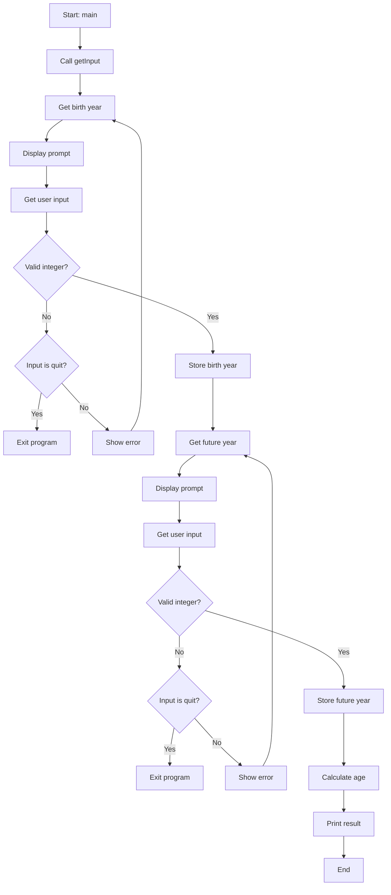

# Age Calculator Algorithm

The following flowchart represents the algorithm implemented in `age.hs`:



## Algorithm Overview

The program follows these main steps:

1. **Input Collection**: Uses `getInput` to collect both birth year and future year
2. **Validation**: Each input goes through `getIntInput` which:
   - Prompts the user with a quit option
   - Validates the input as an integer
   - Handles "quit" command for graceful exit
   - Repeats on invalid input
3. **Calculation**: Simple subtraction (future year - birth year)
4. **Output**: Display the calculated age

## Key Functions

- `stringToLower`: Converts string to lowercase for case-insensitive comparison
- `getIntInput`: Robust integer input with validation and quit functionality
- `getInput`: Orchestrates collection of both required inputs
- `main`: Entry point that coordinates the entire process

## Usage

```bash
# Compile the program
ghc -o age age.hs

# Run the program
./age
```

## Features

- **Input Validation**: Ensures only valid integers are accepted
- **Graceful Exit**: Type "quit" at any prompt to exit
- **Error Handling**: Clear error messages for invalid input
- **Case Insensitive**: Quit command works with any case combination
